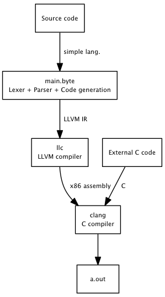

# Implementing a language with LLVM
Term project in Softare Language Engineering at UiB

###INF 225 Term Project by Anton Lindström

For my term project I wanted to focus on how to create a compiler and try to
create an executable program out of code written in a simple language.

I found a tutorial [1] on this topic were the authors used OCaml together with
LLVM to implement all steps. The tutorial also includes a complete
implementation with a lexer, parser and code generation. This tutorial was the
stating point for this project.

The project goals were:

 1. Study and modify the code implemented in the tutorial to fully
    understand on how a lexer and a recursive descent parser works, 
 2. Change the syntax of the language
 3. Create a static compiler - i.e. a program/script that reads code
    and outputs an executable

But wait! What exactly is LLVM? Here is a copy-paste explanation by LiraNuna on
StackOverflow [2]:

 * A library that used to construct, optimize and produce intermediate and/or
   binary machine code.
 * LLVM can be used as a compiler framework, where you provide the "front end"
   (parser and lexer) and the "back end" (code that converts LLVM's
   representation to actual machine code).
 * LLVM can also act as a JIT compiler - it has support for x86/x86_64 and
   PPC/PPC64 assembly generation with fast code optimizations aimed for
   compilation speed.

## The Simple Language

The implemented language is called "The Simple Language" and is a non-turing
complete functional language with poor expression capabilities. Functions,
function calls, if-statements and some binary operations are
supported. The only supported data type is 32-bit integers.

The syntax is inspired by Haskell and Python and looks like this:

```
# A function that computes the square sum of two integers
def squareSum x y = x*x + y*y

# Another useful function
def fun n =
  if 10 < x:
    squareSum(x, x)
  else:
    42
```

Since we're going to compile The Simple Language to LLVM-IR it's also possible
to call function specified in another language. This is abused to call C functions
to perform IO and other things we can't do in our purely functional non-turing
complete language.
The keyword `extern` is used to inform the compiler that the function is
implemented somewhere else:

```
# printint is defined, but not here!
extern pintint x

def main =
  printint(5)
```

We then can define the `printint` function in C:

```
#include <stdio.h>
extern int printint(int x) {
  printf("%d\n", x);
  return 0;
}
```

Since integers is the only supported data type, all parameters and return types
must be `int`.

## The lexer

The lexer described in the tutorial is pretty straightforward. First we have a
set of tokens defined as a data structure in token.ml:

```
type token =
  | Def             (* function definition *)
  | Extern          (* external function definition *)
  | Ident of string (* identifiers *)
  | Number of int   (* numbers *)
  | If | Else       (* if and else *)
  | Kwd of char     (* everything else *)
```

Then we have the actual lexer in `lexer.ml` which is defined as a recursive
function that pattern matches on a character stream and returns a stream of
tokens. The lexer is actually a very basic recursive decent parser.

## The parser

The parser reads a stream of tokens and produces an abstract syntax tree,
defined in `ast.ml`. A function is defined as a prototype and an expression:

```
type func = Function of proto * expr
```

A prototype consists of a name and an array of parameters:

```
type proto = Prototype of string * string array
```

The expression type is defined recursively and looks like this:

```
type expr =
  | Id of string
  | Num of int
  ...
  | PlusExpr of expr * expr
  ...
```

See `ast.ml` for the full definition of the abstract syntax tree.

The parsing starts in `toplevel.ml` and it figures out what is should do based on
the first token of the stream. If it's a function declaration (`def f x = ...`)
or an external declaration (`extern f x`) the respective parsing methods in
`parser.ml` is called and the result is fed to the code generation methods.

Otherwise the parser will treat the input as an anonymous function, parse the
expression and feed it to the code generation methods. If the program is running
in "interactive mode", the execution engine provided by the LLVM library will
then run it and print out the result.

The main parser lives in `parser.ml` and is a recursive decent parser. The
OCaml parsing syntax can be a bit confusing in the beginning. For example, this
is the parser for expressions:

```
let parse_expr = parser
  | [< lhs = parse_primary; stream >] -> parse_bin_rhs 0 lhs stream
```

This function takes a stream of tokens and returns an `expr`. It first apply
the function `parse_primary` on the stream and names the result to `lhs`.
The reminding tokens of `stream` and `lhs` are then used as parameters to
`parse_bin_rhs`. If the stream now starts with an binary operator, its precedence
is looked up in a table and uses that to figure out how to construct the tree.
This is done using the Shunting Yard algorithm.

## Code generation

...

## The compiler

The goal for the compiler was to produce an executable of out of source code.
It's implemented as a shell script described by the following flowchart:



The author considered to implement this directly in OCaml with the LLVM
bindings, but this shell script approach worked good enough.

## Conclusion

I think this was an interesting project. I've never worked with OCaml or LLVM
before so I learned a lot of that. Maybe it would have been more time efficient
to select a language that I already was experienced with, such as Python (
which apparently has LLVM bindings as well).
Another alternative was also Haskell, but I read somewhere that the LLVM
bindings there were pretty "experimental" and inconsistent.

Before this project I thought that code generation was some kind of black magic,
but now it feels like it's more about mapping a language to another. In that sense
I think I started in the wrong end. I should have started with the LLVM IR
language reference [3] and familiarized myself with IR more before I started with
the tutorial.

Also, the example code from the tutorial was probably not the best way to learn
OCaml from scratch :-)

I've learned how a lexer and recursive decent parser works in practice, but next
time I think I'll to use a parser generator. When the grammar is implicitly
defined by the parser it's sometimes hard to get a good overview.

## Sources

 1. http://llvm.org/docs/tutorial/index.html
 2. http://stackoverflow.com/questions/2354725/what-exactly-is-llvm
 3. http://llvm.org/docs/LangRef.html
